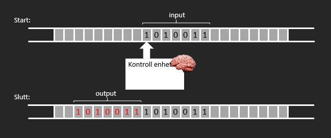

# Challenge 1

Oppgaven er å lage et program (liste av (qssL/Rq)-instruksjoner for en variant av COPY-funksjonen:

Input er en endelig streng  av1-ere og 0-ere. 
Strengen er vilkårlig lang. I figuren vises kun et eksempel på en 7-bits streng.
Algoritmen skal fungere uavhengig av hvor lang inputstrengen er
Oppgaven er å kopiere denne input strengen rett til venstre for strengen, som vist i figuren. Det er ikke viktig hvilken celle algoritmen slutter i.

Tips:

Anta algoritmen starter helt til venstre av inputstrengen. Denne tilstanden kaller vi q0, dvs. starttilstanden. 
Symbolene på tapen er 0,1,b, hvor b står for blank og skrives ikke på figuren av syns skyld.
Du skal definere ett sett med tilstander q1,q2,q3,… Hvor mange tilstander du bruker er helt opp til deg. Jo flere tilstander du bruker, desto «vanskeligere» blir koden å forstå. 

For hver tilstand du definerer må du avgjøre hva du skal gjøre hvis det avleste symbolet er 0,1 eller b.
Sluttilstanden skrives bare som e
Det hjelper å tenke på en tilstand som en «enkel strategi» som du trenger for ¨løse problemet, f.eks. «gå helt til høyre for strengen», «kopier en 1 helt til venstre for strengen» etc. men nå har jeg sagt altfor mye allerede hehe 
